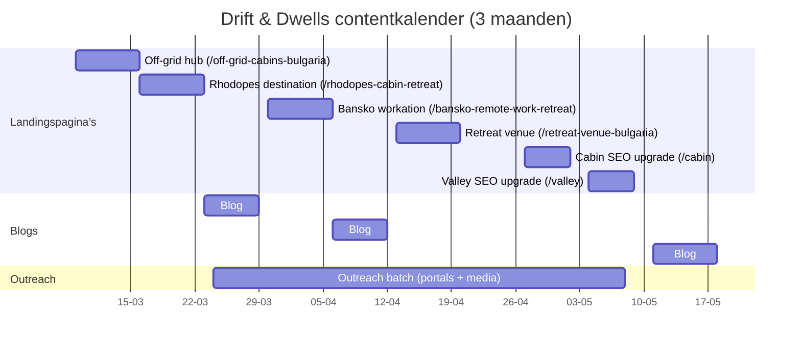

# SEO‑onderzoek en contentplan voor Drift & Dwells

## Executive summary

Drift & Dwells (twee eco/off‑grid verblijven: “The Cabin” en “The Valley”) kan organische zichtbaarheid winnen in **Bulgarije** en **Europa** door niet te vechten op generieke platform‑zoekwoorden (waar entity["company","Booking.com","online travel agency"] vaak domineert), maar door een **hub‑&‑spoke contentarchitectuur** te bouwen rond drie bewezen vraagclusters: **Rhodopes‑bestemming**, **Bansko/remote‑work ecosysteem**, en **off‑grid/digital‑detox**. De Bansko‑regio is extra interessant omdat er aantoonbaar een internationale remote‑work community is ontstaan, gevoed door coworking/coliving en events. citeturn11view1turn6search1turn6search0

Dit rapport levert:
- 30–50 kandidaat‑keywords (EN + BG) met **maandelijks volume (est.)**, **KD (est.)**, intent en prioriteitsscore, met expliciete aannames over datakwaliteit.
- 10–15 definitieve target keywords (mix short‑ en long‑tail; EN + BG) inclusief mapping naar URL’s, plus NL‑drafts voor title/meta.
- 5 SEO‑landingspagina’s (URL, doel, primaire/secundaire keywords, H1, outline + woordtargets, interne link‑ankers).
- 3 autoriteitsblogs (outline, target keywords, PR/link‑angles).
- Lokalisatieadvies: `/bg/...` structuur + hreflang‑strategie en i18n‑notities, conform entity["company","Google","search engine company"] richtlijnen. citeturn0search3turn0search8
- 3‑maanden contentkalender (tabel + mermaid) en een 6‑maanden meet/monitor‑plan.
- 8+ backlink/partner targets in Bulgarije (toerisme/outdoor/nomad) + 3 korte outreach emails.
- Technische 3‑stappen checklist voor hreflang, sitemap en Google Business Profile.

**Belangrijkste uitvoering‑risico’s** (om “hoog ranken” echt mogelijk te maken):
1) **Lokale SEO via Google Business Profile** voor beide locaties is cruciaal; lokale ranking wordt o.a. bepaald door relevantie, afstand en ‘populariteit’ (prominence). citeturn10search0turn8search0turn8search3  
2) **Meertaligheid** moet “strak” via afzonderlijke URL’s per taal + correcte hreflang‑koppeling om verkeerde taal in SERPs en duplicatie‑signalen te vermijden. citeturn0search3turn0search8  
3) Keywordvolumes en KD’s zijn hier grotendeels **(est.)** en moeten vóór publicatie definitief gevalideerd worden in Keyword Planner / Ahrefs / Semrush / Serpstat; KD is per definitie een schatting en verschilt per tool. citeturn3search1turn3search3turn3search2turn3search9

## Doelprofiel, propositie en zoekcontext

### Target business profile
Drift & Dwells is een **kleinschalig premium verblijf** (2 accommodaties) met nadruk op:
- eco/off‑grid sfeer (rust, natuur, eenvoud)
- “reset”/digital‑detox positionering
- (voor The Valley) focus‑werkomgeving voor workation/remote workers

### Primaire value propositions (kort)
- **Off‑grid zonder ‘survival’**: bewust ontkoppelen in comfort (de categorie “digital detox cabins/off‑grid cabins” is in Europa herkenbaar via merken zoals entity["company","Unplugged","digital detox cabin company"] en entity["company","Unyoked","off-grid cabin company"]). citeturn2search0turn2search7turn2search14  
- **Rhodopes als bestemming**: natuur, dorpen, stilte; geschikt voor destination SEO en gidscontent (o.a. via outdoor‑platformen die de Rhodopes als wildlife/nature destination positioneren). citeturn7search7turn7search3  
- **Bansko‑as**: Bansko wordt expliciet beschreven als plek waar coworking‑infrastructuur en internationale nomads samenkomen; dit creëert Engelstalige vraag (workation/remote). citeturn11view1turn6search0turn6search1  

image_group{"layout":"carousel","aspect_ratio":"16:9","query":["Bansko Bulgaria coworking coliving","Rhodope Mountains Bulgaria scenery","off-grid cabin nature retreat Europe"],"num_per_query":1}

### Waarom dit SEO‑technisch de juiste richting is
- Generieke “cabins in Bansko/Rhodopes” SERPs hebben sterke platform‑concurrentie (bijv. cabin‑categoriepagina’s met inventaris en reviews). citeturn6search3turn6search2  
- Een kleine site met 2 accommodaties wint realistischer via **ervaring‑ en bestemming‑zoekintenties** (digital detox, secluded escape, Rhodopes guide, workation near Bansko) + autoriteit via links/partners.

## Concurrenten en SWOT

### Competitor set (Bulgarije)
Directe/serp‑concurrenten in thema eco stay / Rhodopes / detox:
- entity["company","Glamping Zarevo","glamping site, bg"] (Rhodopes glamping). citeturn1search4  
- entity["company","Starview Glamping","glamping site, kutela, bg"] (Smolyan‑regio; glamping + bezienswaardigheden). citeturn1search1turn1search13  
- entity["company","Eco House Art of Living","eco houses, pamporovo, bg"] (eco houses nabij Pamporovo). citeturn1search15  
- entity["company","Balcanic","chillhouse bakyovo, bg"] (positioneert expliciet digital detox/burn‑out reset; bevat ook “work‑life balance” elementen). citeturn1search2turn1search6  
- Platform‑SERPs: cabins/chalets in Bansko en Rhodope Mountains op Booking.com. citeturn6search2turn6search3turn6search7  

### Competitor set (Europa: categorie‑vormers)
Deze merken zijn nuttig als “benchmark” voor messaging, UX en content‑hoek:
- Unplugged: “off grid cabins to switch off and recharge”. citeturn2search0turn2search14  
- Unyoked: “private off‑grid cabin secluded in nature”. citeturn2search7turn2search9  
- entity["company","Canopy & Stars","curated glamping & cabins, uk"]: content over “completely off‑grid cabins” (laat zien dat “off‑grid” als filter/cluster werkt). citeturn2search1turn2search4  
- entity["company","Raus","cabin stays, de/at"]: duurzame design cabins (workation‑narratief komt vaak terug in coverage). citeturn2search2turn2search6  

### Quick SWOT (samenvatting)
| Sterktes | Zwaktes |
|---|---|
| Sterk, verkoopbaar concept (off‑grid/detox) dat in Europa al als categorie bestaat. citeturn2search0turn2search7 | Lage “page inventory”: minder long‑tail pagina’s dan platformen of grotere resorts. |
| Rhodopes + Bansko leveren twee krachtige haakjes: destination SEO + remote‑work vraag. citeturn11view1turn7search7 | Zonder perfecte meertalige structuur kan Google verkeerde taal tonen of duplicatie zien. citeturn0search3turn0search8 |
| Lokale partners (toerisme/outdoor/nomad) zijn concreet bereikbaar. citeturn7search2turn6search1turn7search3 | Map‑pack/local zichtbaarheid vraagt actief beheer (GBP + reviews + updates). citeturn10search0turn8search0 |

| Kansen | Bedreigingen |
|---|---|
| Destination guides (Rhodopes/Bansko) kunnen links verdienen via outdoor media & turist portals. citeturn7search2turn7search3 | SERPs op “cabins/chalets” zijn competitief door Booking‑inventaris. citeturn6search2turn6search3 |
| Bansko remote‑work ecosysteem (coworking/nomad fest) is PR‑waardig en linkbaar. citeturn11view1turn6search1turn6search0 | Glamping‑markt groeit; meer aanbieders en content‑ruis (ook in BG). citeturn7search13turn1search4 |

## Keywordonderzoek en prioritering

### Databronnen, definities en aannames (2026‑03‑05)
- **Volume** = gemiddelde maandelijkse zoekopdrachten; hier vaak **(est.)** wegens geen directe toegang tot jullie Keyword Planner/Ahrefs/Semrush accounts in deze omgeving. Definitieve validatie: Keyword Planner + een EU‑tool zoals Semrush/Serpstat/Ahrefs. citeturn3search11turn3search7turn3search20  
- **KD (keyword difficulty)** = tool‑metric (0–100 of %) die inschat hoe moeilijk top‑posities zijn; verschilt per tool en blijft een schatting. citeturn3search1turn3search3turn3search2turn3search9  
- **Intent**:
  - Transactioneel: “boeken/huren”
  - Commercial investigation: “vergelijken/shortlist”
  - Informational: “leren/plannen”
  - Navigational: merk/site‑gericht

### Kandidatenlijst (40 keywords)
Alle volumes en KD zijn **(est.)** en bedoeld om prioriteit te sturen (niet als “waarheid”). De prioriteitsscore (1–10) weegt: fit met aanbod, intent, en geschatte haalbaarheid vs platform‑SERP.

| Cluster | Keyword | Taal | Volume/maand | KD (0–100) | Intent | Prioriteit |
|---|---|---:|---:|---:|---|---:|
| Rhodopes rentals | вила Родопи | BG | 1.600 (est.) | 65 (est.) | T | 9 |
| Rhodopes rentals | къща под наем Родопи | BG | 1.300 (est.) | 60 (est.) | T | 9 |
| Rhodopes rentals | усамотена къща Родопи | BG | 250 (est.) | 35 (est.) | T | 8 |
| Rhodopes rentals | еко къща Родопи | BG | 200 (est.) | 40 (est.) | C | 8 |
| Rhodopes rentals | къща за двама Родопи | BG | 140 (est.) | 30 (est.) | T | 8 |
| Rhodopes rentals | къща в Родопите | BG | 600 (est.) | 55 (est.) | C | 7 |
| Rhodopes rentals | къща за гости Родопи | BG | 1.200 (est.) | 70 (est.) | C | 7 |
| Rhodopes rentals | почивка в Родопите | BG | 900 (est.) | 65 (est.) | I/C | 6 |
| Off-grid (EU) | off grid cabin Bulgaria | EN | 150 (est.) | 35 (est.) | C | 9 |
| Off-grid (EU) | secluded cabin Bulgaria | EN | 70 (est.) | 25 (est.) | C | 8 |
| Off-grid (EU) | eco cabin Bulgaria | EN | 200 (est.) | 40 (est.) | C | 8 |
| Off-grid (EU) | mountain cabin Bulgaria | EN | 300 (est.) | 55 (est.) | C | 7 |
| Detox (BG) | дигитален детокс | BG | 450 (est.) | 55 (est.) | I/C | 7 |
| Detox (BG) | дигитален детокс почивка | BG | 120 (est.) | 30 (est.) | C | 8 |
| Detox (BG) | почивка без интернет | BG | 90 (est.) | 25 (est.) | C | 8 |
| Detox (EU) | digital detox retreat Bulgaria | EN | 40 (est.) | 20 (est.) | C | 9 |
| Detox (EU) | digital detox retreat Europe | EN | 700 (est.) | 60 (est.) | C | 6 |
| Workation (EU) | remote work retreat Bulgaria | EN | 90 (est.) | 25 (est.) | C | 9 |
| Workation (EU) | workation Bulgaria | EN | 200 (est.) | 45 (est.) | C | 7 |
| Workation (EU) | Bansko workation | EN | 70 (est.) | 25 (est.) | C | 8 |
| Workation (EU) | Bansko digital nomad accommodation | EN | 80 (est.) | 30 (est.) | T | 8 |
| Bansko geo | cabin near Bansko | EN | 120 (est.) | 35 (est.) | T | 8 |
| Bansko geo | Bansko cabin | EN | 500 (est.) | 65 (est.) | C | 6 |
| Bansko geo | къща за гости Банско | BG | 800 (est.) | 75 (est.) | C | 5 |
| Bansko geo | вила Банско | BG | 450 (est.) | 70 (est.) | C | 5 |
| Rhodopes EN | Rhodope Mountains cabin | EN | 150 (est.) | 35 (est.) | C | 8 |
| Rhodopes EN | Rhodope Mountains accommodation | EN | 500 (est.) | 60 (est.) | C | 6 |
| Rhodopes EN | Rhodopes mountain retreat | EN | 120 (est.) | 30 (est.) | C | 8 |
| Destination info | things to do in Bansko summer | EN | 900 (est.) | 65 (est.) | I | 7 |
| Destination info | things to do near Bansko | EN | 350 (est.) | 50 (est.) | I | 7 |
| Destination info | Pirin National Park hikes from Bansko | EN | 200 (est.) | 45 (est.) | I | 6 |
| Couples | къща за двама в планината | BG | 350 (est.) | 45 (est.) | T | 8 |
| Couples | романтична къща за двама | BG | 300 (est.) | 45 (est.) | T | 7 |
| Couples | romantic cabin Bulgaria | EN | 90 (est.) | 25 (est.) | C | 7 |
| Eco stay BG | еко къща България | BG | 200 (est.) | 55 (est.) | C | 6 |
| Retreat B2B | retreat venue Bulgaria | EN | 70 (est.) | 25 (est.) | C | 8 |
| Retreat B2B | yoga retreat venue Bulgaria | EN | 50 (est.) | 20 (est.) | C | 8 |
| Glamping (context) | глемпинг Родопи | BG | 220 (est.) | 50 (est.) | C | 5 |
| Glamping (context) | glamping Rhodopes | EN | 80 (est.) | 35 (est.) | C | 4 |

**Trend‑context (niet volume maar relevant):** een BG outdoor‑media bron verwijst naar Google Trends en meldt groei in interesse voor “glamping”. citeturn7search13

### Top‑10 volumes (ASCII, schattingen)
```
things to do in Bansko summer        900 | ██████████████████
почивка в Родопите                   900 | ██████████████████
вила Родопи                          1600| ██████████████████████████████
къща под наем Родопи                 1300| ████████████████████████
къща за гости Родопи                 1200| ██████████████████████
къща в Родопите                      600 | ████████████
Bansko cabin                          500 | ██████████
Rhodope Mountains accommodation        500 | ██████████
дигитален детокс                      450 | █████████
къща за гости Банско                  800 | ████████████████
```

## Definitieve target keywords en landing page mapping

### Definitieve set (10–15)
Gekozen op business‑fit + intent + haalbaarheid:

**Bulgaars (BG, omzetgericht)**
- вила Родопи  
- къща под наем Родопи  
- усамотена къща Родопи  
- еко къща Родопи  
- къща за двама в планината  
- почивка без интернет  
- дигитален детокс почивка  

**Engels (EU, categorie/ontdekking)**
- off grid cabin Bulgaria  
- eco cabin Bulgaria  
- Rhodope Mountains cabin  
- cabin near Bansko  
- remote work retreat Bulgaria  
- Bansko workation  
- retreat venue Bulgaria *(B2B)*

### Meta title/description richtlijnen (chars)
- **Titles:** Google hanteert geen “hard limiet”, maar in SERP‑weergave worden titles vaak afgekapt; praktisch mik je op ~50–60 tekens voor leesbaarheid. citeturn9search0turn9search20  
- **Descriptions:** snippets worden automatisch gegenereerd en kunnen per query verschillen; meta descriptions helpen CTR, richtwaarde ~150–160 tekens als “display‑comfort”. citeturn9search1turn9search17  

### Mapping tabel (keyword → URL → NL title/meta drafts)
Let op: dit zijn **NL‑drafts** (gevraagd). In uitvoering maak je EN‑versie op `/…` en BG‑versie op `/bg/…` met vertaalde title/meta en hreflang‑koppeling.

| Target keyword | Aanbevolen URL | Meta title (NL‑draft) | Title chars (±) | Meta description (NL‑draft) | Desc chars (±) |
|---|---|---|---:|---|---:|
| off grid cabin Bulgaria | `/off-grid-cabins-bulgaria` | Off‑grid cabins in Bulgarije | 28 | Twee unieke eco‑verblijven in de Bulgaarse bergen. Rust, natuur en echt ontkoppelen. Bekijk The Cabin & The Valley. | 132 |
| eco cabin Bulgaria | `/off-grid-cabins-bulgaria` | Eco cabins in Bulgarije | 22 | Duurzame cabin‑ervaring in Bulgarije: privacy, stilte en sterren. Kies je verblijf en plan je reset. | 117 |
| Rhodope Mountains cabin | `/rhodopes-cabin-retreat` | Cabin in de Rhodopes | 19 | De Rhodopes als bestemming: hikes, dorpen en two stays om te vertragen. Praktische reistips en routes. | 120 |
| вила Родопи | `/bg/vila-rodopi` | Villa in de Rhodopes | 19 | Търсите вила в Родопите? Две уникални еко места за уединение, тишина и природа. | 112 |
| къща под наем Родопи | `/bg/kashta-pod-naem-rodopi` | Huis huren in de Rhodopes | 25 | Къща под наем в Родопите за истинска почивка: тишина, гледки и минимални разсейвания. | 124 |
| усамотена къща Родопи | `/bg/usamotena-kashta-rodopi` | Afgelegen huis in de Rhodopes | 28 | Усамотена къща в Родопите: спокойствие, природа и време без екрани. Проверете наличности. | 129 |
| еко къща Родопи | `/bg/eko-kashta-rodopi` | Eco huis in de Rhodopes | 21 | Еко къща в Родопите: устойчиво бягство сред природата, създадено за бавен ритъм и отдих. | 140 |
| къща за двама в планината | `/bg/kashta-za-dvama-planina` | Berghuisje voor twee | 19 | Романтично бягство за двама: уют, уединение и планинска тишина. Идеално за уикенд reset. | 131 |
| почивка без интернет | `/bg/pochivka-bez-internet` | Vakantie zonder internet | 23 | Почивка без интернет: места за истински дигитален детокс в планината. По‑малко шум, повече сън. | 137 |
| дигитален детокс почивка | `/bg/digitalen-detoks-pochivka` | Digital detox in Bulgarije | 25 | Дигитален детокс почивка: изключете известията и се върнете към природата. Две места, един ритъм. | 139 |
| cabin near Bansko | `/bansko-remote-work-retreat` | Cabin nabij Bansko | 17 | Cabin‑escape nabij Bansko: natuur en stilte, met toegang tot de nomad‑scene. Perfect voor workation of reset. | 137 |
| remote work retreat Bulgaria | `/valley` | Remote work retreat in Bulgarije | 31 | Werk gefocust in de bergen en ontspan daarna. The Valley is gemaakt voor workation, deep work en buitenlucht. | 134 |
| Bansko workation | `/bansko-remote-work-retreat` | Workation in Bansko | 18 | Combineer coworking‑energie met cabin‑rust. Gids + verblijfopties voor remote workers in en rond Bansko. | 132 |
| retreat venue Bulgaria | `/retreat-venue-bulgaria` | Retreat locatie in Bulgarije | 26 | Organiseer een retreat in de Bulgaarse bergen. Rustige setting, natuur en privacy. Vraag beschikbaarheid en capaciteit. | 140 |

## SEO‑landingspagina’s (5) met outlines en interne link‑ankers

### Off‑grid hub page
**URL:** `/off-grid-cabins-bulgaria`  
**Doel:** EN‑hub die “categorie‑taal” vangt (off‑grid/detox) en intern doorstuurt naar Cabin/Valley.  
**Primary keyword:** off grid cabin Bulgaria  
**Secondary keywords:** eco cabin Bulgaria, secluded cabin Bulgaria, digital detox retreat Bulgaria  
**H1 (NL‑concept):** Off‑grid cabins in Bulgarije om echt uit te schakelen  
**Woordtarget:** 1.800–2.400

**Outline**
- Wat “off‑grid” hier betekent (comfort + stilte, niet survival)
- The Cabin vs The Valley (vergelijkingblok)
- Digital detox (praktisch: hoe je ontkoppelt en wat je wél doet)
- Locatie & bereikbaarheid (Sofia/Plovdiv/Bansko)
- Seizoenen (wintering, lente, herfst)
- FAQ + ankers naar boeking/availability

**Interne links + ankerteksten (suggesties)**  
Gebruik beschrijvende ankers (Google raadt duidelijke, crawlbare links/anchor text aan). citeturn9search6  
- Naar `/cabin`: “The Cabin: knus off‑grid verblijf in de bergen”  
- Naar `/valley`: “The Valley: workation‑proof off‑grid retreat”  
- Naar `/rhodopes-cabin-retreat`: “Rhodopes gids: hikes, dorpen en natuur”  
- Naar `/bg/pochivka-bez-internet`: “Почивка без интернет (дигитален детокс)”  

### Rhodopes destination page
**URL:** `/rhodopes-cabin-retreat`  
**Doel:** destination SEO + interne autoriteit (“alles over Rhodopes” → linkhub).  
**Primary keyword:** Rhodope Mountains cabin  
**Secondary:** Rhodopes mountain retreat, къща под наем Родопи, вила Родопи  
**H1:** Cabin‑retreat in de Rhodopes: natuur, dorpen en stilte  
**Woordtarget:** 2.200–3.000

**Outline**
- Waarom de Rhodopes (rustiger dan ‘drukke’ hotspots)
- 10 “things to do” blokken (hikes, uitzichtpunten, dorpen, local food)
- Praktische routeplanning (auto, seizoenen)
- Waar verblijven (Cabin/Valley) + duidelijke CTA’s

**Interne links + ankerteksten**
- Naar `/off-grid-cabins-bulgaria`: “Off‑grid cabins in Bulgarije (overzicht)”  
- Naar `/cabin`: “Boek The Cabin in de Rhodopes”  
- Naar `/valley`: “Boek The Valley: rust + ruimte”  
- Naar blog 3 (Rhodopes gids): “Rhodopes reisgids (uitgebreid)”  

### Bansko workation / “near Bansko” page
**URL:** `/bansko-remote-work-retreat`  
**Doel:** verkeer vangen rond Bansko + positioneren als “rustige basis” (niet hotel‑lijst).  
**Primary keyword:** cabin near Bansko  
**Secondary:** Bansko workation, Bansko digital nomad accommodation, things to do near Bansko  
**H1:** Cabin nabij Bansko voor workation en reset  
**Woordtarget:** 1.600–2.400

**Proof/haakje (bronwaarde):** Bansko wordt expliciet beschreven als locatie waar coworking‑infrastructuur en een internationale nomadcommunity groeit. citeturn11view1turn6search0turn6search1turn6search5

**Outline**
- Waarom Bansko aantrekkelijk is voor remote workers (kort, feitelijk)
- 2 paden: “community” (coworking/events) vs “disconnect” (cabin)
- Logistiek (dagtrip naar Bansko, terug naar stilte)
- Welke stay past beter (Cabin vs Valley)
- CTA: langere stays / mid‑week resets

**Interne links + ankerteksten**
- Naar `/valley`: “The Valley: remote work retreat in Bulgarije”  
- Naar `/off-grid-cabins-bulgaria`: “Off‑grid reset: kies je cabin”  
- Naar blog 2: “Workation gids voor Bansko (tips & checklist)”  

### Product page: The Cabin
**URL:** `/cabin`  
**Doel:** converterende productpagina die ook long‑tail (koppels/romantisch/afgelegen) opvangt.  
**Primary keyword:** romantic cabin Bulgaria *(EN)* / къща за двама в планината *(BG)*  
**Secondary:** secluded cabin Bulgaria, усамотена къща Родопи  
**H1:** The Cabin: knus bergeverblijf om te vertragen  
**Woordtarget:** 1.200–1.800

**Outline**
- Korte USP‑sectie + “availability” CTA
- Voor wie (koppels, reset‑weekend, creators)
- Seizoensverhaal
- Voorzieningen (compact, scannable)
- FAQ + link naar “vakantie zonder internet”

**Interne links + ankerteksten**
- Naar `/off-grid-cabins-bulgaria`: “Off‑grid cabins in Bulgarije (overzicht)”  
- Naar `/bg/kashta-za-dvama-planina`: “Къща за двама в планината”  
- Naar blog 1: “Aylyak: slow living in Bulgarije”  

### B2B / organizer page (retreat venue)
**URL:** `/retreat-venue-bulgaria`  
**Doel:** B2B lead‑capture voor retreat organizers (yoga/creative/workshops).  
**Primary keyword:** retreat venue Bulgaria  
**Secondary:** yoga retreat venue Bulgaria, remote work retreat Bulgaria  
**H1:** Retreat locatie in Bulgarije: rust, natuur en privacy  
**Woordtarget:** 1.400–2.200

**Outline**
- Wat jullie bieden (privacy, omgeving, ritme)
- Capaciteit/indeling (realistisch, geen overclaim)
- Beschikbaarheid/seasonality
- “How it works” (intake, rules, prijzen op aanvraag)
- CTA: aanvraagformulier + 48h response belofte

**Interne links + ankerteksten**
- Naar `/valley`: “The Valley: workation‑ en retreat‑setting”  
- Naar blog 3: “Rhodopes gids: omgeving & activiteiten”  
- Naar contact: “Vraag beschikbaarheid voor jouw retreat”  

## Autoriteitsblogs, backlinks en planning

### Drie autoriteitsblogtopics (met PR/link‑angles)

**Aylyak: de Bulgaarse kunst van traag leven**  
- Target keywords: aylyak / айляк / slow living Bulgaria (est.)  
- Outline: betekenis → mini‑ritueel voor een weekend → itineraries Cabin vs Valley → “how to unplug” zonder preachy tone  
- Link‑angle: pitch naar cultuur/travel media; sluit aan bij “digital detox” categorie die internationaal zichtbaar is. citeturn2search3turn2search0  

**Workation in Bansko (en waarom je daarna de bergen in wil)**  
- Target: Bansko workation, Bansko digital nomad, remote work Bulgaria (est.)  
- Outline: coworking ecosysteem → events/community → focus‑protocol → hoe je 50/50 community & stilte combineert  
- Link‑angle: cross‑post naar coworking en nomad‑event kanalen. citeturn6search0turn6search1turn6search5  

**Rhodopes reisgids: hikes, dorpen, eten en natuur**  
- Target: Rhodope Mountains travel guide, Rhodopes hiking, Родопи забележителности (est.)  
- Outline: per seizoen → 10 hikes → 6 dorpen → eten → etiquette/slow travel → “waar verblijven” (jullie stays)  
- Link‑angle: outreach naar outdoor media en Rhodopes travel portals die al accommodation partners tonen. citeturn7search2turn7search3turn7search7  

### Backlink/partnership targets (minimaal 8) + outreach angle
| Target | Type | Waarom past dit | Outreach angle (kort) |
|---|---|---|---|
| entity["organization","Ministry of Tourism of Bulgaria","tourism ministry, bg"] (TIC Bansko listing) | overheid/toerisme | Verwijst naar officiële TIC‑pagina’s incl. Bansko. citeturn11view2 | Vraag om vermelding van jullie stay(s) als “eco/off‑grid accommodatie” in lokale info of partnerlijst. |
| entity["organization","Visit Bansko","tourist information center, bansko, bg"] | destination portal | Officiële Bansko info portal. citeturn0search1turn11view2 | “Cabin near Bansko” + workation angle; lever EN/BG tekst en foto’s voor een listing. |
| Rhodopemountains.eu | outdoor portal | Heeft accommodation partners & destinations. citeturn7search3turn7search7 | Partner‑accommodatie + co‑created “Rhodopes cabin guide” resource. |
| entity["organization","Camping.BG","outdoor media, bg"] | outdoor media | Media/uitgever/organisator voor camping/outdoor. citeturn7search2 | Redactionele feature “off‑grid cabin als next step na glamping”. |
| Lostinplovdiv.com | travel media | Publiceert Rhodopes/Plovdiv‑regio artikelen en glamping features. citeturn7search1turn7search4 | Pitch: “unplugged weekend in Rhodopes” + fotoreportage. |
| entity["company","Coworking Bansko","coworking & coliving, bansko"] | community/partner | Coworking/coliving + events (64 apartments). citeturn6search0 | Partnerdeal: “focus‑week in cabin + cowork day‑passes” (cross‑link). |
| entity["organization","Bansko Nomad Fest","remote work festival, bansko"] | event/PR | Nomad festival; claimt 800+ bezoekers in 2025. citeturn6search1turn6search5 | Sponsor/partner listing + “post‑fest reset stay” aanbieding. |
| Altspace / Nestwork coworking | coworking | Meerdere coworking aanbieders in Bansko. citeturn6search16turn6search12 | “Workation partner” pagina: rustige stay‑optie buiten de drukte. |
| (Bonus) Bulgarije glamping/eco directories | directories | Glamping/eco stays worden actief gecureerd. citeturn7search6turn1search16 | Listing + “eco/off‑grid in Rhodopes” differentiator. |

### Drie outreach email templates (kort, exact)
**Template A — naar Visit Bansko (listing request)**  
Onderwerp: Eco/off‑grid verblijf toevoegen aan Visit Bansko (EN + BG tekst + foto’s)

Hallo Visit Bansko team,  
Ik ben [NAAM] van Drift & Dwells. We bieden twee kleinschalige eco/off‑grid verblijven in de bergen, op korte afstand van Bansko — ideaal voor bezoekers die natuur en rust zoeken (ook populair bij workation‑gasten).  
Zouden jullie een accommodatie‑vermelding kunnen toevoegen op jullie site? Ik lever direct:  
- EN + BG beschrijving (150–250 woorden)  
- 6–10 foto’s (web‑ready)  
- locatie + contact + URL  
Als jullie een format hebben, volg ik dat graag. Dank!  
Groet,  
[NAAM]  
[TEL] · [EMAIL] · driftanddwells.com

**Template B — naar Camping.BG (redactionele feature)**  
Onderwerp: Idee voor artikel: “off‑grid cabin” (Rhodopes) als alternatief voor glamping

Hallo Camping.BG redactie,  
Ik volg jullie coverage rond camping/glamping en outdoor. We hebben een interessant verhaal voor jullie lezers: twee “off‑grid” cabin stays in de Rhodopes, gericht op stilte/digital detox (geen party‑accommodatie).  
Ik kan een perskit sturen (foto’s + factsheet) en desgewenst een gastartikel met praktische Rhodopes tips. Past dit in jullie agenda?  
Groet,  
[NAAM] · Drift & Dwells  
[EMAIL] · [TEL]

**Template C — naar rhodopemountains.eu (partner + resource link)**  
Onderwerp: Accommodation partnership + Rhodopes “cabin guide” resource

Hi [NAME],  
We run Drift & Dwells: two small eco/off‑grid stays in the Rhodope region. I noticed you feature “Accommodation Partners” and destination resources.  
Could we be considered as an accommodation partner? We can also co‑create a useful resource page for your audience (“Rhodopes cabin retreat: hikes + villages + practical planning”) and link both ways.  
Happy to send details, coordinates, and photo pack.  
Best,  
[NAME] · Drift & Dwells  
[EMAIL] · [PHONE]

### Contentkalender (3 maanden) + mermaid timeline

**Tabel (productievolgorde)**
| Week | Output | Kernactie |
|---|---|---|
| W1 | `/off-grid-cabins-bulgaria` | copy + vergelijking Cabin/Valley + CTA’s |
| W2 | `/rhodopes-cabin-retreat` | destination research + 10 activiteitenblokken |
| W3 | Blog: Aylyak | publiceer + outreach batch (culture/travel) |
| W4 | `/bansko-remote-work-retreat` | workation‑angle + partner links (coworking) |
| W5 | Blog: Workation Bansko | outreach naar coworking/nomad kanalen |
| W6 | `/retreat-venue-bulgaria` | B2B structuur + lead form + FAQ |
| W7 | SEO upgrade `/cabin` | intent‑copy + interne links |
| W8 | SEO upgrade `/valley` | remote work‑copy + interne links |
| W9 | Blog: Rhodopes gids | outreach naar outdoor/portals |

**Mermaid timeline**


## Lokalisatie, KPIs en monitoring

### URL‑structuur en hreflang strategie
**Aanbevolen structuur**
- EN default: `/...`  
- BG: `/bg/...`  

Waarom: Google adviseert verschillende URL’s per taal/locale en gebruikt hreflang om varianten te koppelen; hreflang helpt Google begrijpen dat pagina’s gelokaliseerde varianten zijn. citeturn0search3turn0search8

**Hreflang regels (essentie)**
- Voeg op elke EN‑pagina een `hreflang="bg"` alternate toe naar de BG‑variant, en vice‑versa (reciprocal). citeturn0search3turn0search8  
- Overweeg `x-default` voor een taalkeuzepagina of voor `/` als je ooit automatische locale‑routing doet. citeturn0search8  
- Zet ook `lang` attribuut in HTML correct; Google detecteert taal algoritmisch, maar correcte markup helpt consistentie. citeturn0search3  

### i18n notities (kort, pragmatisch)
- Houd **één taal per URL** (geen gemengde EN/BG secties op dezelfde route).  
- Vertaal niet alleen UI‑strings, maar ook: H1/H2, FAQ, CTA’s, title/meta, alt‑tekst voor hero‑images.

### Google Business Profile (Local SEO) voor beide locaties
- Voor accommodaties is een hotel/accommodation‑profiel in Google Business Profile expliciet ondersteund (guide voor hotels). citeturn8search0turn8search3  
- Lokale ranking is primair gebaseerd op **relevance, distance, popularity**; volledige en consistente business details + reviews dragen bij aan “prominence”. citeturn10search0turn10search5  
- Reviews: geen incentives of “fake engagement”; dit is verboden onder Google policies. citeturn8search10turn8search13  

### KPIs om te tracken
| KPI | Tool | Doel (6 maanden) |
|---|---|---|
| Indexatie: 5 landingspagina’s + 3 blogs (EN + BG) | Search Console | 100% geïndexeerd; fouten < 1% |
| Impressions/clicks op 10–15 target keywords | Search Console | duidelijk stijgende trend; BG‑queries zichtbaar |
| Gemiddelde positie op top 10 targets | rank tracker | 5 keywords in top‑10, 2 in top‑5 (realistisch) |
| Organic sessions naar hub pages | Analytics | +30–80% vs baseline (afhankelijk seizoen) |
| Conversions: availability check / booking start | Analytics/events | +15–40% op organisch verkeer |
| New referring domains (quality) | Ahrefs/Semrush (later) | 8–15 nieuwe relevante domeinen |

### Monitoringplan (6 maanden)
- Maand 1: baseline + indexatie + eerste CTR‑tweaks (titles/snippets). citeturn9search1turn9search0  
- Maand 2: interne linking optimaliseren op basis van Search Console queries (anker‑teksten verbeteren). citeturn9search6  
- Maand 3: update content voor “near‑miss” posities (11–20) + outreach batch 2.  
- Maand 4–5: uitbreiden van gidsen met extra “linkable assets” (checklists/kaartblokken); meer partners.  
- Maand 6: her‑prioriteer targets op basis van echte performance; plan volgende contentcluster.

### Technische 3‑stappen checklist (hreflang, sitemap, GBP)
**Hreflang (3 stappen)**
1) Maak EN↔BG URL‑mapping tabel (één‑op‑één) en publiceer beide pagina’s live. citeturn0search3  
2) Voeg per pagina `rel="alternate" hreflang="en"` en `hreflang="bg"` toe (reciprocal), optioneel `x-default`. citeturn0search3turn0search8  
3) Valideer met Lighthouse/SEO checks en in Search Console (hreflang fouten). citeturn0search10  

**Sitemap (3 stappen)**
1) Genereer XML sitemap met alleen **canonicals** en alleen URL’s die je wilt laten indexeren. citeturn8search2turn11view3  
2) Voeg (optioneel) hreflang alternates toe in sitemap als je dat pad kiest; Google ondersteunt localized versions in XML sitemaps. citeturn11view3turn8search8  
3) Submit in Search Console en zet de sitemap‑regel in robots.txt. citeturn11view3turn8search5  

**Google Business Profile (3 stappen)**
1) Claim/verifieer 2 profielen (één per locatie), kies correcte categorie en adres/marker. citeturn8search3turn8search1  
2) Vul amenities/foto’s/posts en zorg voor NAP consistentie; lokale ranking hangt o.a. af van relevance/popularity. citeturn10search0turn10search5  
3) Review‑flow: vraag om eerlijke reviews (geen vergoeding/incentives). citeturn8search10  

## Bronnen, aannames en checklist

### Belangrijkste bronnen (selectie)
- Bansko remote‑work context & infrastructuur: citeturn11view1turn6search0turn6search1turn6search5  
- Platform‑concurrentie (cabins/chalets in Rhodope/Bansko): citeturn6search2turn6search3turn6search7  
- BG concurrenten (glamping/eco/detox): citeturn1search4turn1search1turn1search15turn1search2turn1search6  
- EU categorie‑vormers (off‑grid/detox cabincategory): citeturn2search0turn2search7turn2search4turn2search2turn2search3  
- Google international SEO/hreflang: citeturn0search3turn0search8  
- Google sitemaps en “localized versions”: citeturn11view3turn8search8turn8search2  
- Google Business Profile (hotels) + local ranking factoren + review policy: citeturn8search0turn8search3turn10search0turn8search10  
- KD/keyword tooling definities (Semrush/Ahrefs/Serpstat): citeturn3search1turn3search3turn3search2turn3search9  
- Anchor text/link best practices: citeturn9search6  
- Titles/snippets best practices: citeturn9search0turn9search1  

### Expliciete aannames
- Talen: EN + BG; geen betaalde ads; budget low/medium; volumes later valideren in Keyword Planner/Semrush/Ahrefs/Serpstat. citeturn3search7turn3search20  
- Volumes/KD in tabellen zijn **(est.)** en dienen voor prioritering, niet als definitieve forecast.

### Actiechecklist (direct uitvoerbaar)
- Finaliseer 5 landingspagina’s in EN (draft) + maak BG counterpart structuur (`/bg/...`) klaar.
- Publiceer: `/off-grid-cabins-bulgaria`, `/rhodopes-cabin-retreat`, `/bansko-remote-work-retreat`, `/retreat-venue-bulgaria` + verbeter `/cabin` en `/valley`.
- Schrijf en publiceer 3 blogs (Aylyak, Workation Bansko, Rhodopes gids) en link intern naar de hubs.
- Start outreach (minstens 20 targets): begin met Visit Bansko/TIC + Camping.BG + rhodopemountains.eu.
- Zet 2 Google Business Profiles op (verificatie), optimaliseer categorie/amenities/foto’s en implementeer review‑flow zonder incentives. citeturn8search10turn10search0  
- Implementeer hreflang + sitemap‑uitbreiding en valideer. citeturn0search3turn11view3