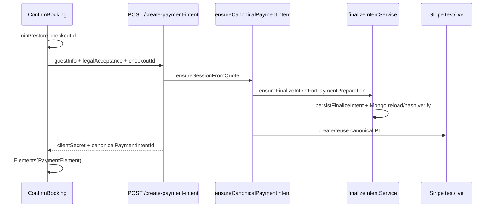

# Accommodation payment preparation — forensic audit

Date: 2026-07-29  
Baseline HEAD audited: `95f5f33b37e306f65a02e36cf609aaa2e7effba2`  
Prior baseline: `26578ac354061117e033385468084c0bdf205511`  
Local repository work only. No production MongoDB, Stripe, or deploy.

## 1. Exact current failure reproduced

Production-equivalent Express route + MongoMemoryServer + Stripe test double, modeling the **deployed Vite flag list from the 95f5f33 release notes** (finalize flags on, **`VITE_CHECKOUT_SESSION_V2` omitted**):

| Field | Value |
|--------|--------|
| HTTP status | **409** |
| Error code | **`FINALIZE_INTENT_REQUIRED`** |
| Public message | `We couldn’t prepare the secure payment form. Please try again.` |
| CheckoutSession | created, `payment_required`, `sessionVersion` 1 |
| `finalizeIntentHash` | `null` |
| `canonicalPaymentIntentId` | `null` |
| Stripe PI | not created |

Evidence: `.scratch/payment-prep-forensic/forensic-a-v2-client-off.json`  
Test: `server/scripts/paymentPrepForensicReproduction.test.cjs` (FORENSIC A)

## 2–3. HTTP status, error code, failing source line

- **Status:** 409  
- **Code:** `FINALIZE_INTENT_REQUIRED`  
- **Source:** `server/services/checkout/finalizeIntentService.js` → `ensureFinalizeIntentForPaymentPreparation` when `!hasPayload && required` (throws `CheckoutSessionError` with `FINALIZE_INTENT_REQUIRED`; mapped by `mapCheckoutSessionErrorToHttp` in `checkoutSessionRouteAdapter.js`).

## 4. Request payload contract (success path)

Required for strict V2 payment preparation:

- Commercial: `cabinId` **or** `cabinTypeId`, `checkIn`, `checkOut`, `adults`, `children`, `experienceKeys[]`
- Identity: `checkoutId` (stable UUID), `expectedSessionVersion`
- Finalize: `guestInfo.{firstName,lastName,email,phone}`, `legalAcceptance.{acceptedTermsAndCancellation,acceptedActivityRisk,termsVersion,activityRiskVersion,checkbox1TextSnapshot,checkbox2TextSnapshot,locale?}`, `consents` (all false), `specialRequests?`

## 5. Response contract (success)

`formatV2CreatePaymentIntentResponse`: `success`, `checkoutId`, `flowVersion`, `sessionStatus`, `paymentStatus`, `quoteSnapshotHash`, `sessionVersion`, `clientSecret`, `canonicalPaymentIntentId`, `finalizeIntentHash`, `stripeAmountCents`, `giftVoucherAppliedCents`, `fullVoucherCoverage`, `voucherRedemptionId`, `idempotentReplay`, `noPaymentRequired`.

Failure contract (normalized): `{ success:false, code, message, details:{ checkoutId?, sessionVersion?, field?, correlationId } }`.

## 6. Frontend → Stripe flow



## 7. Feature-flag matrix

| Flag | Source | Default | Notes |
|------|--------|---------|-------|
| `CHECKOUT_SESSION_V2` | server env | off | Now also inferred when finalize persist/required on |
| `FINALIZE_INTENT_PERSIST` | server env | off | |
| `FINALIZE_INTENT_REQUIRED_FOR_PI` | server env | off | |
| `VITE_CHECKOUT_SESSION_V2` | Vite compile | off | |
| `VITE_FINALIZE_INTENT_PERSIST` | Vite compile | off | |
| `VITE_FINALIZE_INTENT_REQUIRED_FOR_PI` | Vite compile | off | Implies client V2 after fix |

**Invalid combo (pre-fix):** server REQUIRED=1 + V2 on, client built with finalize Vite flags but **without** `VITE_CHECKOUT_SESSION_V2` → payload omit → 409 REQUIRED.

## 8. sessionVersion transitions (cold start, client-minted id)

| Step | Version |
|------|---------|
| Create session | 1 |
| Persist finalizeIntent | 2 |
| Claim/create PI (may bump) | ≥2 |
| Response `sessionVersion` | authoritative post-op |

Client cold-start default `expectedSessionVersion: 1` is **not** applied as a pre-existing concurrency check when no prior server session exists; same-request persist uses authoritative version.

## 9. Retry / idempotency

| Case | Result |
|------|--------|
| Missing finalize payload (old client) | 409 REQUIRED; adopt `details.checkoutId` before any retry |
| Stable checkoutId × 3 retries | 1 session, 1 PI |
| Parallel prep | one canonical winner |
| Validation / immutable / stale version | not retried |

## 10. Service worker / cache

- Navigation denylist already excluded `/api/`.
- Added explicit **NetworkOnly** for `/api/`, `create-payment-intent`, `checkout-session`.
- `skipWaiting` + `clientsClaim` remain; handshake reloads incompatible tabs.

## 11. Observability

- Structured `payment_preparation_failed` log (no PII).
- Safe `details.correlationId` on payment-prep failures.
- Express validator failures → `PAYMENT_PREP_VALIDATION_FAILED` + correlationId.

## 12. Root causes found

1. **Primary (post-95f5f33 production):** Finalize payload still gated on `checkoutSessionV2Enabled`. Deploy listed `VITE_FINALIZE_INTENT_*=1` but **not** `VITE_CHECKOUT_SESSION_V2` → client omitted `guestInfo`/`legalAcceptance` → `FINALIZE_INTENT_REQUIRED` / 409.
2. **Earlier (pre-95f5f33):** null V2 `checkoutId` + blind retries → three orphan sessions (already fixed in 95f5f33).
3. **Flag defaults:** V2 and finalize flags default OFF; no build-time fail-closed for skew.
4. **Observability gap:** handled 409s returned generic UI copy without correlation telemetry.

## 13. Fixes made

- Infer client/server V2 when strict finalize flags are on.
- Always attach finalize payload when guest+legal ready (not V2-gated).
- Build verifier `scripts/verifyCheckoutPaymentPrepBuild.mjs`.
- `GET /api/bookings/checkout-capabilities` + client handshake/reload.
- Payment-prep observability + correlationId; validator error code.
- SW NetworkOnly for API/payment routes.
- Production-build Playwright E2E through real routes + `client/dist`.

## 14. Remaining risks

- Stale open tabs with **pre-fix** bundles still omit finalize until reload/handshake.
- Vite build must set finalize (and ideally explicit V2) flags; verifier must run in CI/release.
- Stripe Elements iframe may not appear under test-double `pk_test_*` without Stripe.js accepting the fake secret; E2E asserts API contract + UI absence of generic error + secret delivery.
- Apache-hosted SPA (not Express) means API/SPA deploy skew remains an ops concern — handshake mitigates.

## 15. Production-build E2E evidence

Command:

```bash
cd client && \
  VITE_CHECKOUT_SESSION_V2=1 \
  VITE_FINALIZE_INTENT_PERSIST=1 \
  VITE_FINALIZE_INTENT_REQUIRED_FOR_PI=1 \
  VITE_STRIPE_PUBLISHABLE_KEY=pk_test_forensic_e2e \
  npx vite build
VITE_CHECKOUT_SESSION_V2=1 VITE_FINALIZE_INTENT_PERSIST=1 VITE_FINALIZE_INTENT_REQUIRED_FOR_PI=1 \
  node scripts/verifyCheckoutPaymentPrepBuild.mjs
cd server && node --test scripts/paymentPrepProductionBuildE2E.test.cjs
```

Result: **pass** — HTTP 200, `guestInfo`+`legalAcceptance` present, one CheckoutSession, finalizeIntentHash set, one canonical PI + clientSecret, no generic prep error.

Artifacts:

- `.scratch/payment-prep-forensic/production-build-e2e.json`
- `.scratch/payment-prep-forensic/production-build-e2e.png`
- `.scratch/payment-prep-forensic/forensic-a-v2-client-off.json`

## Assumptions introduced by 26578ac → 95f5f33 (pre-this-audit)

1. Stable client-minted `checkoutId` alone would stop orphan sessions.
2. Attaching finalize when `checkoutSessionV2Enabled && guestOk && legalOk` was enough even if Vite finalize flags were on.
3. Cold-start version handling was the main remaining concurrency risk.
4. Focused unit/integration suites without a production Vite build E2E were sufficient to ship.

Assumption (2) was **false** for the documented deploy flag set.
