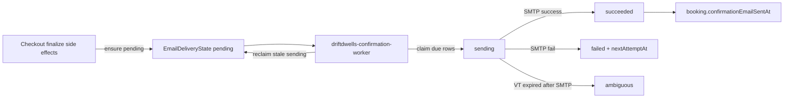

# Booking confirmation delivery worker audit

**Date:** 2026-07-31  
**Scope:** Local repository only. No production access. No live email.

---

## Root cause

Confirmed bookings created durable `EmailDeliveryState` rows (`domain=booking_lifecycle`, `templateKey=booking_confirmed`, `latestStatus=pending`) during checkout finalization side effects, but **no continuously running process drained overdue pending rows**.

`processBookingConfirmationDelivery({ send: true })` was only invoked inside `checkoutFinalizeSideEffects` when `FINALIZE_WORKER_SEND_CONFIRMATION=1` ran in the same finalize tick. After that path finished (or when finalize queued with `send=false`), pending rows with overdue `nextAttemptAt` and `attemptCount: 0` remained untouched forever.

Incident shape (manually recovered later):

| Field | Observed |
|-------|----------|
| Booking | confirmed |
| EmailDeliveryState | pending |
| attemptCount | 0 |
| nextAttemptAt | overdue |
| EmailEvent | absent |
| confirmationEmailSentAt | unset |

---

## Why enabled finalize flags were insufficient

Production already had:

- `FINALIZE_JOB_EXECUTE=1`
- `FINALIZE_SIDE_EFFECTS=1`
- `FINALIZE_WORKER_SEND_CONFIRMATION=1`

Those flags make finalization **enqueue and optionally send once** during finalize. They do **not** create a backlog consumer. A crash, SMTP blip, or enqueue-only path leaves pending rows with no sweeper.

---

## Architecture



**Ownership:** Dedicated PM2 process `driftdwells-confirmation-worker` is the authoritative production consumer. The API process must keep `BOOKING_CONFIRMATION_DELIVERY_WORKER_ENABLED` unset/`0`.

**State machine:** Reuses `bookingConfirmationDeliveryService.js` only — no second delivery implementation.

---

## Delivery state transitions

| From | Trigger | To |
|------|---------|-----|
| — | ensure pending | pending |
| pending/failed (due) | claim | sending |
| sending | SMTP success | succeeded |
| sending | SMTP failure | failed (+ backoff) or terminal failed |
| sending, VT expired, no smtpAttemptStartedAt | reclaim | pending |
| sending, VT expired, smtpAttemptStartedAt set | reclaim | ambiguous |
| pending/failed/sending | missing/cancelled/mismatch | failed terminal (abandoned) |

Ambiguous states are never auto-resent.

---

## Lease / crash behavior

- Visibility timeout: `CONFIRMATION_DELIVERY_VISIBILITY_TIMEOUT_MS` (default 5 minutes), owned by the delivery service.
- Crash before SMTP → reclaim to pending → safe retry.
- Crash after SMTP started → ambiguous → no uncontrolled resend.
- Concurrent workers: atomic claim on `correlationKey` → exactly one send.

---

## Environment variables

| Variable | Default | Purpose |
|----------|---------|---------|
| `BOOKING_CONFIRMATION_DELIVERY_WORKER_ENABLED` | false | Start worker (shared boolean parser) |
| `BOOKING_CONFIRMATION_DELIVERY_WORKER_TICK_MS` | 30000 | Poll interval |
| `BOOKING_CONFIRMATION_DELIVERY_WORKER_SWEEPER_TICK_MS` | 60000 | Stale-lease sweep interval |
| `BOOKING_CONFIRMATION_DELIVERY_WORKER_BATCH_SIZE` | 20 | Max due rows per tick |
| `BOOKING_CONFIRMATION_DELIVERY_WORKER_ID` | hostname#pid… | Optional worker id |
| `CONFIRMATION_DELIVERY_VISIBILITY_TIMEOUT_MS` | 300000 | Existing lease timeout (service) |

Not inferred from `FINALIZE_*` flags.

---

## Health / readiness

- API: `GET /api/ops/confirmation-delivery-health`
- Ops UI: Communication oversight panel includes confirmation worker + overdue backlog
- Main API health does **not** fail solely on temporary SMTP send failures
- `healthy` requires: SMTP configured **and** worker enabled+running **and** no overdue pending due rows **and** no ambiguous backlog

Example:

```json
{
  "smtpConfigured": true,
  "workerEnabled": true,
  "workerRunning": true,
  "deliveryHealth": "ok",
  "healthy": true,
  "backlog": {
    "pendingDueCount": 0,
    "totalPendingCount": 0,
    "sendingCount": 0,
    "failedCount": 0,
    "ambiguousCount": 0
  }
}
```

---

## PM2 process

File: `ecosystem.config.cjs`

```bash
pm2 start ecosystem.config.cjs --only driftdwells-confirmation-worker --env production
```

Script: `server/scripts/runBookingConfirmationDeliveryWorker.js`  
npm: `cd server && npm run start:booking-confirmation-delivery-worker`

---

## Deployment instructions

1. Deploy code with confirmation worker.
2. Ensure API env has `BOOKING_CONFIRMATION_DELIVERY_WORKER_ENABLED=0` (or unset).
3. Start/reload PM2 process with production env (`BOOKING_CONFIRMATION_DELIVERY_WORKER_ENABLED=1`).
4. Confirm structured log `booking_confirmation_worker_started`.
5. Confirm health endpoint shows `workerRunning: true` and `pendingDueCount: 0` after drain.

## Rollback

1. `pm2 stop driftdwells-confirmation-worker` (or set flag `0` and restart).
2. Pending rows remain durable; no data loss.
3. Manual recovery still possible via `processBookingConfirmationDelivery({ send: true })`.

---

## Production verification procedure (post-deploy; do not run from Cursor)

1. `pm2 list` → `driftdwells-confirmation-worker` online.
2. `GET /api/ops/confirmation-delivery-health` → running, no overdue backlog.
3. Create a controlled test booking (or seed non-prod).
4. Observe EmailDeliveryState: pending → sending → succeeded.
5. Verify EmailEvent, `confirmationEmailSentAt`, provider message id.
6. Confirm no duplicate guest email.
7. Restart worker; ensure no second send for succeeded rows.
8. Worker logs: `booking_confirmation_worker_tick` / `_succeeded`.

---

## Files

- `server/services/email/bookingConfirmationDeliveryWorker.js`
- `server/services/email/bookingConfirmationDeliveryHealthService.js`
- `server/services/email/bookingConfirmationDeliveryService.js` (abandon + findDue)
- `server/scripts/runBookingConfirmationDeliveryWorker.js`
- `server/scripts/bookingConfirmationDeliveryWorker.test.cjs`
- `server/routes/ops/modules/confirmationDeliveryHealthRoutes.js`
- `ecosystem.config.cjs`
- Ops communications oversight UI + read model

## Remaining risks

- Ambiguous rows still need human review (by design).
- Recipient mismatch abandons rather than rebinding to a new email (safe; avoids wrong inbox).
- If PM2 process is not started, backlog will accumulate again despite correct finalize flags.
