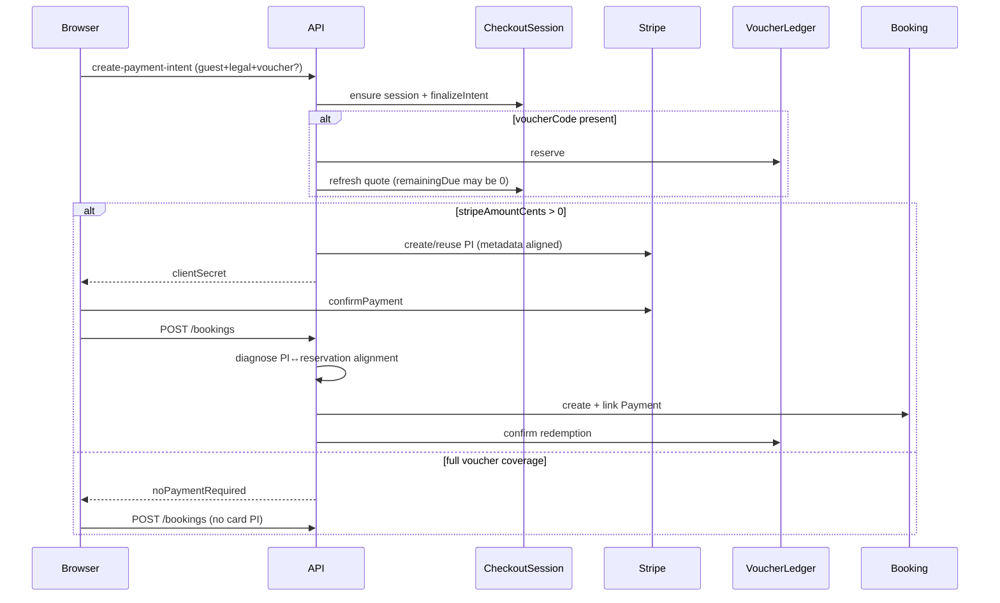
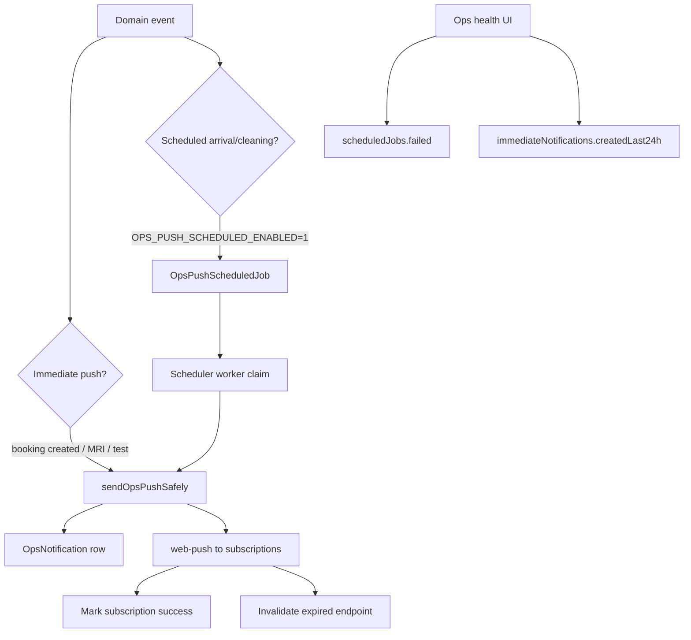

# Core payments, vouchers, and notifications stability audit

**Date:** 2026-07-30  
**Scope:** Local repository only. No production database, Stripe, email, push provider, or deploy access.  
**Gate:** Production Vite build + Express + MongoMemory + deterministic adapters + Playwright E2E.

---

## 1. Audit of uncommitted stabilization diffs (pre-fix)

| Change | Problem | Evidence | Regression risk | Decision |
|--------|---------|----------|-----------------|----------|
| Remove V2←finalize inference (`featureFlags.js`, `checkoutSessionV2Flags.js`) | `CHECKOUT_SESSION_V2=0` was ignored when finalize flags were on | Local: explicit `0` still returned `true` under `a984080` | Ops must set V2 explicitly; missing VITE_V2 fails closed via verifier | **KEEP** |
| Capability handshake: no auto-reload | `location.reload()` destroyed form / Elements mid-checkout | `ConfirmBooking.jsx` + handshake `shouldReload: true` | Stale bundles need manual refresh | **KEEP** |
| Build verifier requires explicit `VITE_CHECKOUT_SESSION_V2` with required finalize | Inference hid misconfigured releases | Deploy omission of VITE_V2 → `FINALIZE_INTENT_REQUIRED` | Non-payment builds must pass env when verifying payment contract | **KEEP** (strengthened to fail closed) |
| ConfirmBooking attaches finalize when guest+legal ready | Gating on V2 alone caused 409 | Forensic `paymentPrepForensicReproduction.test.cjs` | None if server remains authoritative | **KEEP** (already on master) |

---

## 2. Reproduced failures

### A. Accommodation payment preparation (prior / confirmed)

- **Status:** HTTP 409  
- **Code:** `FINALIZE_INTENT_REQUIRED`  
- **Cause:** Client omitted `guestInfo`/`legalAcceptance` when V2 Vite flag missing while server required finalize.  
- **Source:** `server/services/checkout/finalizeIntentService.js` → `ensureFinalizeIntentForPaymentPreparation`.

### B. Gift-voucher booking finalization MRI (this audit)

- **Category:** `payment_finalization_failure`  
- **Details:** `Stripe PaymentIntent metadata or amount does not align with voucher reservation at booking finalization`  
- **Source line:** `server/routes/bookingRoutes.js` (alignment gate calling `diagnoseVoucherPaymentIntentAlignment`)  
- **Checked fields:** `redemptionId`, `checkoutId`, `voucherAppliedCents`, `stripeAmountCents` (`pi.amount`)

**Primary mismatch fields on the historical race (stale full-amount PI + reservation):**

1. `redemptionId` — PI metadata empty vs reserved redemption id  
2. `voucherAppliedCents` — PI `0` vs reserved applied cents  
3. `stripeAmountCents` — PI full stay amount vs `totalValueCents - voucherAppliedCents`

**Authoritative root cause (happy-path charge bug):**

- In `server/services/bookingQuoteService.js`,  
  `remainingDueCents = Number(voucherPreview.remainingDueCents || remainingDueCents)`  
  treated **`0` as falsy**, so full voucher coverage kept `remainingDueCents = totalValueCents`.  
- Snapshot then stored `fullVoucherCoverage: true` with `stripeAmountCents: totalValueCents`, creating a full-amount PaymentIntent while a voucher reservation existed → finalization MRI / overcharge risk.

**Secondary root cause (post-pay voucher attach):**

- Applying a voucher after a succeeded full-amount PI could reserve a voucher and/or supersede into a second PI.  
- Fixed: refuse voucher-after-paid; require paid PI to match session before reuse.

### C. Notifications “healthy” while silent

- Ops scheduled-job health can show `failed: 0` with **zero jobs**.  
- Immediate pushes use `OpsNotification` + web-push, not `OpsPushScheduledJob`.  
- `payment_finalization_failure` did not emit push.  
- Checkout worker finalize side effects did not call `notifyOpsPushBookingCreated`.

### D. Feature-flag / SW release churn

- Duplicate boolean parsers; verifier could print `{ ok: true }` with all flags false.  
- SW `skipWaiting` + `clientsClaim` + `onNeedRefresh → location.reload()` interrupted open payment tabs.

---

## 3. State diagrams

### Payment + voucher (happy path)



### Notification pipeline



---

## 4. Flag matrix

| Flag | Truthy | Falsy / missing | Parser |
|------|--------|-----------------|--------|
| `1`,`true`,`on`,`yes` | true | — | `shared/env/parseBooleanFlag.js` |
| `0`,`false`,`off`,`no`, unset, junk | false (or default via `WithDefault`) | — | same |

**Server:** `CHECKOUT_SESSION_V2`, `FINALIZE_INTENT_PERSIST`, `FINALIZE_INTENT_REQUIRED_FOR_PI`, …  
**Client Vite:** `VITE_CHECKOUT_SESSION_V2`, `VITE_FINALIZE_INTENT_PERSIST`, `VITE_FINALIZE_INTENT_REQUIRED_FOR_PI`  
**Rule:** Finalize flags must **not** imply V2. Guest/legal payload attach is independent of V2 when data is valid.

---

## 5. Release / deployment contract

Payment release build **must** set:

- Client: `VITE_CHECKOUT_SESSION_V2=1`, `VITE_FINALIZE_INTENT_PERSIST=1`, `VITE_FINALIZE_INTENT_REQUIRED_FOR_PI=1`, `VITE_STRIPE_PUBLISHABLE_KEY`, `VITE_FRONTEND_RELEASE`
- Server: matching `CHECKOUT_SESSION_V2`, `FINALIZE_INTENT_*`

Verifier: `npm run verify:checkout-payment-prep-build`  
- Inspects `client/dist` bundle markers  
- Writes `client/dist/release-manifest.json`  
- **Fails closed** when required effective values are false  
- Safe API: `GET /api/bookings/checkout-capabilities` includes `paymentContractVersion`

---

## 6. Service worker findings

| Finding | Status |
|---------|--------|
| `/api/**` NetworkOnly | Retained |
| Payment responses never SW-cached | Retained |
| `skipWaiting` on install | **Removed** — activate via `SKIP_WAITING` message |
| Auto `location.reload` on update | **Removed** — `dd:sw-update-available` event; blocked when `sessionStorage.dd_payment_flow_active=1` |
| Confirm / gift voucher set payment-active marker | Added |

---

## 7. Root causes (exact)

1. **Full voucher `remainingDueCents` falsy `||` trap** — `bookingQuoteService.js` (primary MRI / overcharge source).  
2. **V2 inferred from finalize flags** — hid misconfigured deploys; blocked V2 rollback.  
3. **Capability auto-reload** — customer-visible checkout instability.  
4. **Voucher after paid PI** — reservation/MRI race; now rejected.  
5. **Ops health misread** — scheduled `failed=0` ≠ delivery.  
6. **MRI / worker missing push** — operators not alerted.  
7. **SW force-activate + reload** — mid-payment tab replacement.

---

## 8. Fixes retained

- Remove V2←finalize inference (server + client)  
- No capability auto-reload  
- Fail-closed build verifier + release manifest  
- Shared `parseBooleanFlag`  
- `remainingDueCents` zero-safe assignment  
- Refuse voucher-after-paid; paid PI must match session  
- PI metadata `giftVoucherId` / `reservationKey`  
- MRI evidence: `failedInvariant`, `mismatchedFields`, `correlationId`  
- Push on `payment_finalization_failure`; worker booking-created push  
- Health: `immediateNotifications`  
- SW controlled update; payment-flow marker  
- Unified harness `corePaymentsNotificationsStabilityE2E.test.cjs`

## 9. Fixes reverted / not done

- No automatic refunds  
- No aggressive retries  
- No checkout auto-reload  
- Optional marketing/quote/reminder consents remain removed  
- Two legal acknowledgements retained  
- Strict finalize enforcement retained when enabled  

---

## 10. Remaining risks

- Stripe.js cannot complete a real card charge against a fake publishable key in Playwright; accommodation charge+finalize is proven via browser PI prep + server succeed+booking (same session).  
- Immediate push still requires VAPID + active subscriptions in real Ops.  
- Controlled SW update UI is event-based; product toast can be layered later.  
- Old open tabs on prior SW builds may still auto-update until this SW ships.

---

## 11. E2E evidence

**Commands:**

```bash
cd client && \
  VITE_CHECKOUT_SESSION_V2=1 \
  VITE_FINALIZE_INTENT_PERSIST=1 \
  VITE_FINALIZE_INTENT_REQUIRED_FOR_PI=1 \
  VITE_STRIPE_PUBLISHABLE_KEY=pk_test_stability \
  VITE_FRONTEND_RELEASE=<id> \
  npx vite build

cd .. && \
  VITE_CHECKOUT_SESSION_V2=1 \
  VITE_FINALIZE_INTENT_PERSIST=1 \
  VITE_FINALIZE_INTENT_REQUIRED_FOR_PI=1 \
  VITE_STRIPE_PUBLISHABLE_KEY=pk_test_stability \
  VITE_FRONTEND_RELEASE=<id> \
  npm run verify:checkout-payment-prep-build

cd server && node --test \
  scripts/corePaymentsNotificationsStabilityE2E.test.cjs \
  scripts/paymentPrepProductionBuildE2E.test.cjs \
  scripts/voucherRedemptionFinalizeAlignment.test.cjs \
  scripts/parseBooleanFlag.test.cjs
```

**Totals (local gate run):** 8 production-build harness tests + 5 voucher alignment + 2 parser = **pass / 0 fail**.  
Artifacts: `.scratch/core-stability-e2e/`, `.scratch/payment-prep-forensic/`.

---

## 12. Confirmations

- Strict enforcement remains enabled in release contract.  
- Optional consent controls remain removed.  
- No production system accessed.  
- Nothing deployed from this work (push of git commit only when requested).
